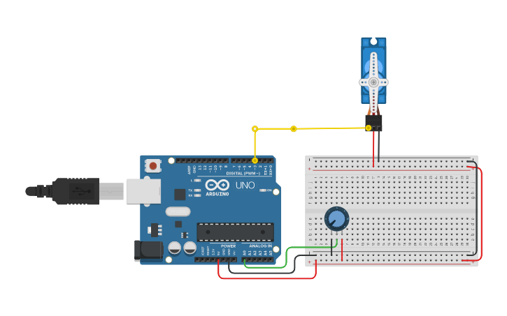

# Sistemas-Embarcados

Atividades da aula de Sistemas Embarcados no 3ºano na ETEC

## [LED Bascio](/LED_Basico)
### Desafio:
- Fazer uma pisca pisca basica 
- Fazer ele piscar em ordens alternados
### Estrutura
.png "Pisca pisca")

## [LED com interação buttão](/LED_BTN/)
### Desafio:
- Atribua cada entrada de LED RGB a um potenciômetro
- Ao girar um potenciômetro, a cor atribuída a ele será gradualmente intensificada.
- Ao girar simultaneamente dois ou mais potenciômetros, a cor será misturada.
### Estrutura
.png "Pisca pisca")

## [Semáforo](/Semaforo)
### Desafio:
- Fazer uma Semaforo que alterancia sicrano
- Fazer um lope
### Estrutura
.png "Semáforo")

## [LED RGB](/LED_RGB/)
### Desafio:
- Trocar as cores do Led
### Estrutura

## [LED RGB Potentiometer](/LED_RGB_Toggle/)
### Desafio:
- Atribua cada entrada de LED RGB a um potenciômetro
- Ao girar um potenciômetro, a cor atribuída a ele será gradualmente intensificada.
- Ao girar simultaneamente dois ou mais potenciômetros, a cor será misturada.
### Estrutura

## [LED Sequencia com e sem button](/LED_Sequence/)
### Desafio:
- Alterar as sequencias e ordem de ligar e desliagr os leds
- gerar valor aleatório para o led RGB
- usar o buttoão para mudar a sequencia
### Estrutura

## [Servo com button](/Servo_BTN/)
### Desafio:
- Usar servo
- usar o buttoão para mexer o Servo
### Estrutura

## [Servo com Potenciometer](/PinoPot_Servo/)
### Desafio:
- Usar servo
- usar o potenciometer para mexer o Servo
### Estrutura

